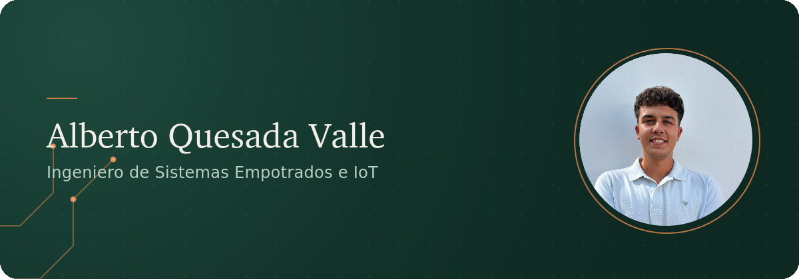

  

### Hola 👋, soy Alberto

Ingeniero Informático especializado en sistemas empotrados e IoT, recién graduado y con ganas de arrancar en mi primer equipo de desarrollo.

- 🔭 Buscando activamente mi primera incorporación a un equipo de desarrollo de hardware/IoT
- 💬 Pregúntame sobre: Arduino, LoRaWAN, IoT, C/C++, Python, TDD
- 📫 Cómo contactarme: [albertoquesadavalle@gmail.com](mailto:albertoquesadavalle@gmail.com)

**Repos destacados**

- 🔗 [Analizador de cobertura LoRaWAN](https://github.com/albertoqv/analizador-cobertura-lorawan) — TFG, nota 9,5/10
- 🔗 [PolipoX](enlace-pendiente) — Hackathon IMIBIC, asistente de voz para uso clínico
- 🔗 [aritmetica-eso](https://github.com/albertoqv/aritmetica-eso) — PWA educativa, en uso real en un aula de 1º ESO
- 🔗 [Summer Camp Manager](enlace-pendiente) — Arquitectura Limpia + TDD, proyecto de equipo

**Conecta conmigo**

**Lenguajes y herramientas**

**Estadísticas**

